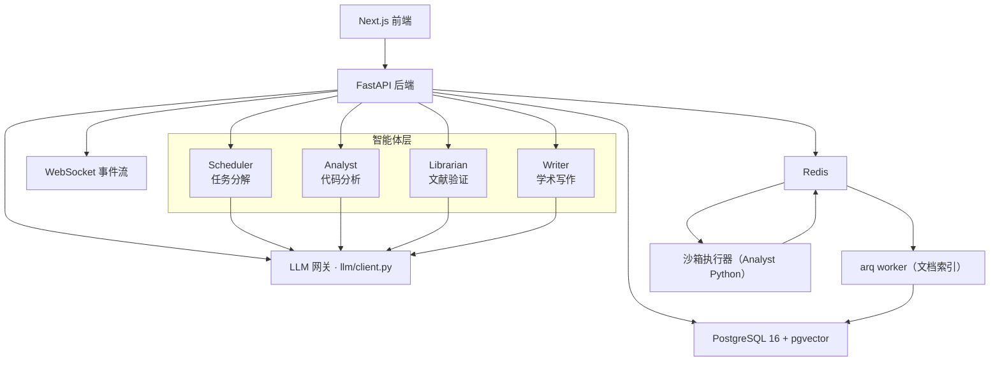
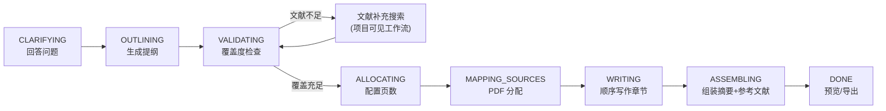

# ClawScholar

> 主动式学术研究工作台——多智能体协作、文献验证、有来源的学术写作。

<div align="center">

**[中文](README.md) | [English](README_en.md)**

[](https://python.org)
[](https://fastapi.tiangolo.com)
[](https://nextjs.org)
[](https://github.com/pgvector/pgvector)
[](docker-compose.yml)

</div>

---

## 项目简介

ClawScholar 是一个面向学术研究者的多智能体研究自动化平台。用户只需输入一个自然语言研究目标，系统即可自动完成任务分解、数据分析、文献检索与验证，最终输出经过引用来源支撑的学术文档。

**核心差异化特性：验证循环（Validation Loop）**
所有分析结果必须经过 Librarian 智能体的文献验证才能呈现给用户，确保研究输出的可靠性。

ClawScholar 不是简单的聊天机器人，而是一个透明的工作流系统：界面实时展示当前项目进度、智能体活动、文献检索进程、Writer 覆盖度检查、章节写作状态及最终导出结果。

---

## 核心功能

| 功能模块 | 描述 |
|---|---|
| **研究项目管理** | 创建项目、明确目标、启动工作流，并查看完整的工作流历史记录 |
| **多智能体研究流水线** | Scheduler 分解任务 → Analyst 运行沙箱 Python → Librarian 验证结果，形成闭环 |
| **文献库（Library）** | 上传 PDF、提取文本、AI 摘要、分块索引至 PostgreSQL pgvector，支持混合检索 |
| **Writer 学术写作** | 生成提纲、检查文献覆盖度、文献补充搜索、顺序写作各章节、组装最终文档，导出 Word/PDF |
| **实时进度流** | 通过 WebSocket 实时推送智能体状态、文献搜索进度、写作进度等所有事件 |

---

## 系统架构



### 服务组成

| 服务 | 作用 |
|---|---|
| `frontend` | Next.js 14 仪表盘、工作台、聊天、文献库、Writer 界面 |
| `backend` | FastAPI API、WebSocket 流、任务编排、鉴权、文档导出 |
| `worker` | arq 工作进程，负责文档索引与 AI 摘要生成 |
| `postgres` | 关系型主数据库 + pgvector 文档向量块 |
| `redis` | 任务队列、沙箱通信、轻量缓存 |
| `sandbox` | 隔离的 Python 执行容器（无网络、只读文件系统） |

---

## 工作流详解

### 研究流水线


1. **Scheduler**：将目标分解为结构化子任务计划
2. **Analyst**：在隔离沙箱中编写并执行 Python 分析代码
3. **Librarian**：对比已索引的文献库内容，验证分析结论
4. 若 Librarian 拒绝，Analyst 携带反馈重试（最多 3 次）
5. 仅验证通过后，结果才呈现给用户

### 文献检索

支持以下学术数据库，自动生成多组搜索查询、过滤、去重、下载开放获取 PDF 并自动索引：

| 数据源 | 说明 |
|---|---|
| arXiv | 可靠的直接 PDF 链接 |
| Semantic Scholar | 元数据、引用数据、开放获取链接 |
| PubMed / Europe PMC | 生物医学元数据及开放 PDF |
| CORE | 开放获取全文检索 |
| OpenAlex | 元数据回退与摘要重建 |

### Writer 学术写作流水线



| 阶段 | 说明 |
|---|---|
| `CLARIFYING` | 用户回答文档类型相关的澄清问题 |
| `OUTLINING` | 基于用户请求和文献库摘要生成结构化提纲，前端实时展示智能体活动卡片 |
| `VALIDATING` | 每个章节与已索引 PDF 进行向量检索比对，输出覆盖度评分、缺失主题和建议查询 |
| `ALLOCATING` | 用户审阅/调整章节顺序并配置页数分配；覆盖度不足时主按钮锁定，引导补充文献 |
| 文献补充搜索 | 创建项目可见的细化工作流，复用文献搜索流水线，在 Writer 和工作台实时推流 |
| `MAPPING_SOURCES` | PDF 映射至各章节，界面展示已分配 PDF、相关性及可展开摘要 |
| `WRITING` | 顺序写作各章节，后续章节可获得前序章节的上下文；每节均附带分配来源和全文献清单 |
| `ASSEMBLING` | 组装完整文档，为论文/文章写作最终摘要，后端确定性地追加参考文献 |
| `DONE` | 用户可预览 Markdown 并导出 DOCX / PDF |

**引用规则：**
- Writer 输出始终引用已分配的 PDF 来源
- 来源标记（如 `[S1]`）在全文中保持一致
- 参考文献由后端确定性追加，LLM 不生成参考文献
- 前端预览与导出文件内容完全一致

---

## 前端路由

| 路由 | 功能 |
|---|---|
| `/dashboard` | 项目概览、工作流历史、智能体日志 |
| `/workspace` | 项目工作台、文献搜索面板、细化对话 |
| `/chat` | 对话界面，含工具调用徽章和 Writer 运行卡片 |
| `/writer` | 完整写作工作流（从创建到导出），支持 `?run=<id>` 直链 |
| `/library` | 上传区、索引健康度、文档表格与 PDF 查看器 |
| `/schedule` | 本地计划事件管理 |
| `/settings` | 用户与界面设置 |

---

## 快速开始

### 环境要求

- Docker Desktop（含 Compose v2）
- OpenAI API Key

### 启动

```bash
# 1. 复制环境变量模板并填写必要值
cp .env.example .env
# 至少填写 OPENAI_API_KEY 和 JWT_SECRET_KEY

# 2. 启动所有服务
docker compose up -d --build

# 3. 打开界面
open http://localhost:3000       # 前端
open http://localhost:8000/docs  # 后端 API 文档
```

### 常用命令

```bash
make up            # 启动所有服务
make build         # 构建镜像
make logs          # 查看全部日志
make logs-backend  # 查看后端日志
make migrate       # 运行数据库迁移
make seed          # 导入演示数据
make health        # 检查服务健康状态
```

> **提示：** 如果 Docker 构建时出现包下载超时，重试即可。后端 Dockerfile 已配置较长的 `uv`/pip 超时时间，但镜像仓库或 Docker Desktop 偶发的网络问题可能导致失败。

---

## 环境变量

| 变量 | 必填 | 说明 |
|---|:---:|---|
| `OPENAI_API_KEY` | ✅ | 所有 LLM 功能的必要密钥 |
| `OPENAI_MODEL` | ✅ | 默认 `gpt-4.1-mini` |
| `JWT_SECRET_KEY` | ✅ | 生产环境请使用 32 位以上随机字符串 |
| `POSTGRES_USER` / `POSTGRES_PASSWORD` / `POSTGRES_DB` | ✅ | Compose 数据库配置 |
| `DATABASE_URL` | ✅ | 异步 SQLAlchemy 连接串，Compose 自动配置 |
| `REDIS_URL` | ✅ | 任务队列与沙箱通信 |
| `NEXT_PUBLIC_API_URL` | ✅ | 前端 API 基础 URL |
| `NEXT_PUBLIC_WS_URL` | ✅ | 前端 WebSocket 基础 URL |
| `EMBEDDINGS_API_KEY` | 可选 | 启用向量嵌入；缺失时降级为 BM25 检索 |
| `EMBEDDINGS_BASE_URL` | 可选 | 兼容 OpenAI 的嵌入接口地址 |
| `EMBEDDINGS_MODEL` | 可选 | 默认 `text-embedding-3-small` |
| `SANDBOX_TIMEOUT_SECONDS` | 可选 | 默认 `30` |
| `RUN_MIGRATIONS_ON_STARTUP` | 可选 | 默认 `true` |

---

## 技术栈

| 层级 | 技术 |
|---|---|
| 前端 | Next.js 14 App Router · TypeScript · Tailwind CSS · Zustand · Framer Motion |
| 后端 | FastAPI · SQLAlchemy 2.0（异步）· Alembic · structlog · python-docx · reportlab |
| 数据库 | PostgreSQL 16 + pgvector |
| 队列 / 缓存 | Redis · arq |
| 沙箱 | Docker（隔离容器）· pandas / numpy / matplotlib / scipy / scikit-learn |
| LLM | OpenAI API（通过 `llm/client.py` 统一调用） |
| 部署 | Docker Compose |

---

## 项目结构

```text
backend/
  app/
    agents/          Scheduler、Analyst、Librarian、Writer 智能体
    api/             FastAPI 路由与 WebSocket
    core/            数据库、Redis、日志、鉴权基础设施
    llm/client.py    统一 LLM 调用入口（所有 LLM 调用均经此处）
    models/          SQLAlchemy ORM 模型
    schemas/         Pydantic 请求/响应模型
    services/        业务逻辑与导出服务
    skills/          智能体提示词技能文件
    tasks/           arq worker 任务
  alembic/versions/  数据库迁移文件

frontend/
  src/app/           Next.js 路由页面
  src/components/    UI 组件（writer/、workspace/、library/ 等）
  src/hooks/         WebSocket、鉴权、上传 Hooks
  src/stores/        Zustand 状态管理
  src/types/         TypeScript 类型定义

sandbox/             隔离 Python 执行容器
scripts/             数据种子、健康检查、API 类型生成
```

---

## 数据库迁移

| 迁移文件 | 内容 |
|---|---|
| `001_add_chat_schedule_document_enhancements.py` | 核心表：用户、项目、目标、工作流、文档、聊天、日程 |
| `002_add_projects_and_document_chunks.py` | 项目管理与 pgvector 文档块 |
| `003_add_writer_agent.py` | Writer 运行记录、章节、输出 |
| `004_change_target_pages_to_numeric.py` | 页数分配精度优化 |
| `005_ensure_document_chunks.py` | 确保文档块存储正常 |
| `006_add_writing_intent_to_goals.py` | 目标写作意图字段 |
| `007_link_writer_runs_to_projects.py` | Writer 与项目/工作流关联 |

---

## 当前已知限制

| 功能 | 现状 |
|---|---|
| 日历 OAuth 与外部日历写回 | 未实现 |
| WeChat / Telegram 消息推送 | 未接入 |
| BibTeX / RIS 引用导出 | 未实现 |
| Analyst 代码流式输出 | 未实现（当前全量返回） |
| 自动化测试覆盖 | 极少；生产环境使用前请补充 |
| 交叉编码器 GPU 重排序 | 回退为 CPU；`sentence_transformers` 可选 |

---

## 贡献指南

请阅读 [AGENTS.md](AGENTS.md) 了解代码库结构、架构约束和编码规范。

核心规则：
- 所有 LLM 调用必须经过 `backend/app/llm/client.py`，禁止直接调用 provider SDK
- Analyst 输出未经 Librarian 验证前不得呈现给用户
- API 路由保持轻量，业务逻辑下沉至 `services/`
- 严格 TypeScript 模式：不使用 `any` 或 `@ts-ignore`

---

<div align="center">
由 <a href="https://github.com/OpenClawSJTU">OpenClaw @ SJTU</a> 构建
</div>
