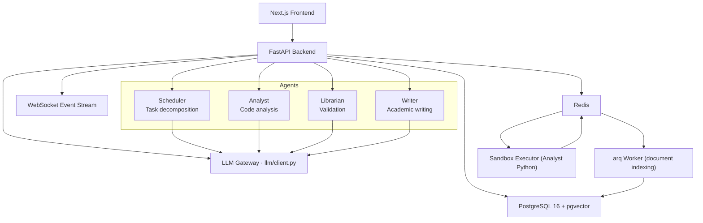
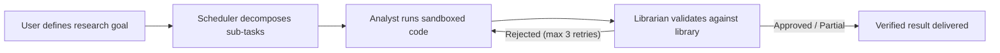
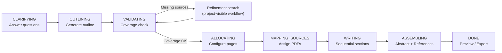

# ClawScholar

> Proactive multi-agent research workflows, validated analysis, and source-grounded academic writing.

<div align="center">

**[中文](README.md) | [English](README_en.md)**

[](https://python.org)
[](https://fastapi.tiangolo.com)
[](https://nextjs.org)
[](https://github.com/pgvector/pgvector)
[](docker-compose.yml)

</div>

---

## What is ClawScholar?

ClawScholar is a multi-agent research automation workspace for academic users. Give it a natural-language research goal and it decomposes the task, runs sandboxed analysis, validates every claim against a private literature library, and composes cited documents from downloaded PDFs.

It is designed as a **transparent workflow system** rather than a chatbot: the UI continuously shows the active project, agent activity, literature search progress, Writer coverage checks, section drafting state, and final export options.

**Core differentiator — Validation Loop:**
Analyst output is never shown to the user without a Librarian verdict. If rejected, the Analyst retries with feedback (up to 3 times), ensuring research outputs are grounded in verified evidence.

---

## Feature Overview

| Area | What it does |
|---|---|
| **Research Projects** | Create projects, clarify goals, start project-linked workflow runs, inspect workflow history |
| **Multi-Agent Pipeline** | Scheduler decomposes goals → Analyst runs sandboxed Python → Librarian validates results against the library |
| **Literature Library** | Upload PDFs, extract text, AI summarize, chunk and index into PostgreSQL pgvector, hybrid retrieval |
| **Writer** | Generate outlines, check source coverage, run refinement literature searches, write sections with assigned PDFs, assemble final document, export Word/PDF |
| **Real-time Event Stream** | WebSocket push for all agent status, literature search decisions, writing progress, and phase transitions |

---

## Architecture



### Services

| Service | Purpose |
|---|---|
| `frontend` | Next.js 14 dashboard, workspace, chat, library, writer UI |
| `backend` | FastAPI API, WebSocket stream, orchestration, auth, document exports |
| `worker` | arq worker for document indexing and AI summaries |
| `postgres` | Main relational database + pgvector document chunks |
| `redis` | Task queue, sandbox communication, lightweight cache |
| `sandbox` | Isolated Python executor (no network, read-only filesystem) |

---

## Workflows

### Research Pipeline



1. **Scheduler** creates a structured plan from the goal
2. **Analyst** writes and executes Python analysis in an isolated container
3. **Librarian** validates conclusions against indexed library chunks
4. On rejection, the Analyst retries with feedback (max 3 iterations)
5. Only validated results are surfaced to the user

### Literature Search

Searches five academic providers, generates multiple targeted queries, filters by title and abstract, deduplicates, downloads open-access PDFs, and automatically indexes them:

| Provider | Notes |
|---|---|
| arXiv | Reliable direct PDF links |
| Semantic Scholar | Metadata, citations, open-access PDF links |
| PubMed / Europe PMC | Biomedical metadata and open PDFs |
| CORE | Open-access full-text search |
| OpenAlex | Metadata fallback and abstract reconstruction |

### Writer Pipeline



| Phase | Description |
|---|---|
| `CLARIFYING` | User answers document-specific questions |
| `OUTLINING` | Structured outline generated from request, answers, and library summaries; frontend shows live agent activity cards |
| `VALIDATING` | Each section checked against indexed PDFs; produces coverage scores, missing topics, and suggested queries |
| `ALLOCATING` | User reviews/reorders chapters and configures page counts; main button is locked when coverage is insufficient |
| Refinement search | Creates a project-visible workflow, reuses the literature pipeline, streams the Literature Search panel in Writer and Workspace |
| `MAPPING_SOURCES` | PDFs assigned to sections; UI shows PDFs, relevance, and expandable summaries |
| `WRITING` | Sections written sequentially so later chapters receive prior context; each section gets assigned sources and the full document source inventory |
| `ASSEMBLING` | Full document assembled, final abstract written for papers/articles, references appended deterministically by the backend |
| `DONE` | Markdown preview + DOCX / PDF export |

**Citation rules:**
- Writer always cites assigned PDF sources
- Source keys (e.g. `[S1]`) are stable across the whole document
- References are appended deterministically by backend code — the LLM does not generate them
- Frontend preview and exported files contain identical content

---

## Frontend Routes

| Route | Purpose |
|---|---|
| `/dashboard` | Project overview, workflow pipeline, agent feed |
| `/workspace` | Project workspace, literature search panel, refinement chat |
| `/chat` | Conversational interface with tool-call badges and Writer run cards |
| `/writer` | Full writing workflow from intake to export; supports `?run=<id>` deep-link |
| `/library` | Upload zone, index health, document table, PDF viewer |
| `/schedule` | Local scheduled event management |
| `/settings` | User and UI settings |

---

## Quickstart

### Prerequisites

- Docker Desktop (with Compose v2)
- OpenAI API Key

### Start

```bash
# 1. Copy the environment template and fill in required values
cp .env.example .env
# At minimum: OPENAI_API_KEY and JWT_SECRET_KEY

# 2. Start all services
docker compose up -d --build

# 3. Open the app
open http://localhost:3000       # Frontend
open http://localhost:8000/docs  # Backend API docs
```

### Useful commands

```bash
make up            # Start all services
make build         # Build images
make logs          # Tail all logs
make logs-backend  # Tail backend logs only
make migrate       # Run Alembic migrations
make seed          # Seed demo data
make health        # Check service health
```

> **Note:** If Docker builds time out during package downloads, retry. The backend Dockerfile sets extended `uv`/pip timeouts, but transient network issues can still occur.

---

## Environment Variables

| Variable | Required | Notes |
|---|:---:|---|
| `OPENAI_API_KEY` | ✅ | Required for all LLM-backed agents |
| `OPENAI_MODEL` | ✅ | Defaults to `gpt-4.1-mini` |
| `JWT_SECRET_KEY` | ✅ | Use a long random string in production |
| `POSTGRES_USER` / `POSTGRES_PASSWORD` / `POSTGRES_DB` | ✅ | Compose database config |
| `DATABASE_URL` | ✅ | Async SQLAlchemy URL; Compose sets this automatically |
| `REDIS_URL` | ✅ | Task queue and sandbox communication |
| `NEXT_PUBLIC_API_URL` | ✅ | Frontend API base URL |
| `NEXT_PUBLIC_WS_URL` | ✅ | Frontend WebSocket base URL |
| `EMBEDDINGS_API_KEY` | Optional | Enables vector embeddings; degrades to BM25-only without it |
| `EMBEDDINGS_BASE_URL` | Optional | OpenAI-compatible embedding endpoint override |
| `EMBEDDINGS_MODEL` | Optional | Defaults to `text-embedding-3-small` |
| `SANDBOX_TIMEOUT_SECONDS` | Optional | Defaults to `30` |
| `RUN_MIGRATIONS_ON_STARTUP` | Optional | Defaults to `true` |

---

## Tech Stack

| Layer | Technology |
|---|---|
| Frontend | Next.js 14 App Router · TypeScript · Tailwind CSS · Zustand · Framer Motion |
| Backend | FastAPI · SQLAlchemy 2.0 (async) · Alembic · structlog · python-docx · reportlab |
| Database | PostgreSQL 16 + pgvector |
| Queue / Cache | Redis · arq |
| Sandbox | Docker (isolated container) · pandas / numpy / matplotlib / scipy / scikit-learn |
| LLM | OpenAI API (via unified `llm/client.py` gateway) |
| Deployment | Docker Compose |

---

## Repository Map

```text
backend/
  app/
    agents/          Scheduler, Analyst, Librarian, Writer agents
    api/             FastAPI routers and WebSocket endpoint
    core/            Database, Redis, logging, auth primitives
    llm/client.py    Single LLM gateway (all LLM calls go here)
    models/          SQLAlchemy ORM models
    schemas/         Pydantic request/response schemas
    services/        Business logic and export services
    skills/          Agent prompt skill files (SOUL.md, *_SKILL.md)
    tasks/           arq worker tasks
  alembic/versions/  Database migrations

frontend/
  src/app/           Next.js route pages
  src/components/    UI components (writer/, workspace/, library/, ...)
  src/hooks/         WebSocket, auth, upload hooks
  src/stores/        Zustand state stores
  src/types/         TypeScript domain types

sandbox/             Isolated Python execution container
scripts/             DB seed, health check, API type generation
```

---

## Database Migrations

| Migration | Content |
|---|---|
| `001_add_chat_schedule_document_enhancements.py` | Core tables: users, projects, goals, workflows, documents, chat, schedule |
| `002_add_projects_and_document_chunks.py` | Project management and pgvector document chunks |
| `003_add_writer_agent.py` | Writer runs, sections, outputs |
| `004_change_target_pages_to_numeric.py` | Numeric page allocation precision |
| `005_ensure_document_chunks.py` | Document chunk storage verification |
| `006_add_writing_intent_to_goals.py` | Writing intent fields on goals |
| `007_link_writer_runs_to_projects.py` | Writer run to project/workflow linkage |

---

## Development

Backend verification:

```bash
python3 -m compileall backend/app
docker compose config --quiet
```

Frontend verification:

```bash
cd frontend
npm run type-check
```

---

## Known Limitations

| Feature | Status |
|---|---|
| Calendar OAuth and external calendar write-back | Not implemented |
| WeChat / Telegram delivery | Not wired |
| BibTeX / RIS citation export | Not implemented |
| Streaming Analyst code output | Not implemented (full output returned at end) |
| Automated test coverage | Minimal; add backend and frontend tests before production use |
| Cross-encoder GPU reranking | Falls back gracefully if `sentence_transformers` is unavailable |

---

## Contributing

Read [AGENTS.md](AGENTS.md) for the full codebase guide: architecture, file roles, agent flows, coding rules, and common pitfalls.

Core rules:
- All LLM calls must go through `backend/app/llm/client.py` — never call provider SDKs directly
- Analyst output must not reach the user without a Librarian verdict
- Keep API routes thin; business logic belongs in `services/`
- TypeScript strict mode: no `any`, no `@ts-ignore`

---

<div align="center">
Built by <a href="https://github.com/OpenClawSJTU">OpenClaw @ SJTU</a>
</div>
